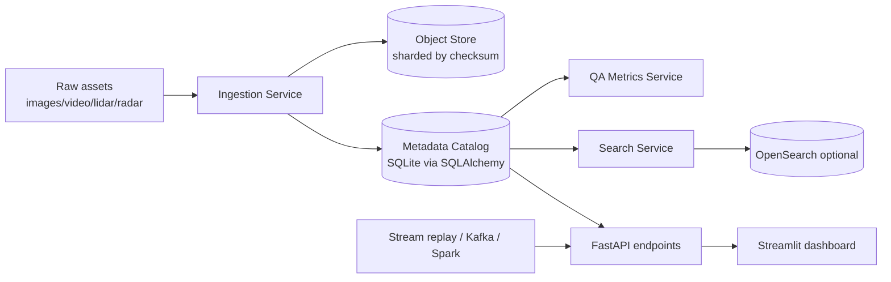

# Architecture

## Data model

- `ingestion_runs`: pipeline lineage + status (`running`, `completed`, `failed`)
- `assets`: source/object URIs, sensor metadata, shard id, checksum
- `annotations`: label class, annotator id, bbox, quality score

## Key runtime paths

1. Batch ingestion: `/api/ingest` reads JSONL and writes object store + metadata.
2. Streaming ingest: `/api/stream/events` and `/api/stream/events/batch` process event records incrementally.
3. Discovery: `/api/assets/search` queries SQL or OpenSearch (if enabled).
4. Quality analytics: `/api/qa/summary` computes missing labels, disagreement rate, class distribution, hard examples.
